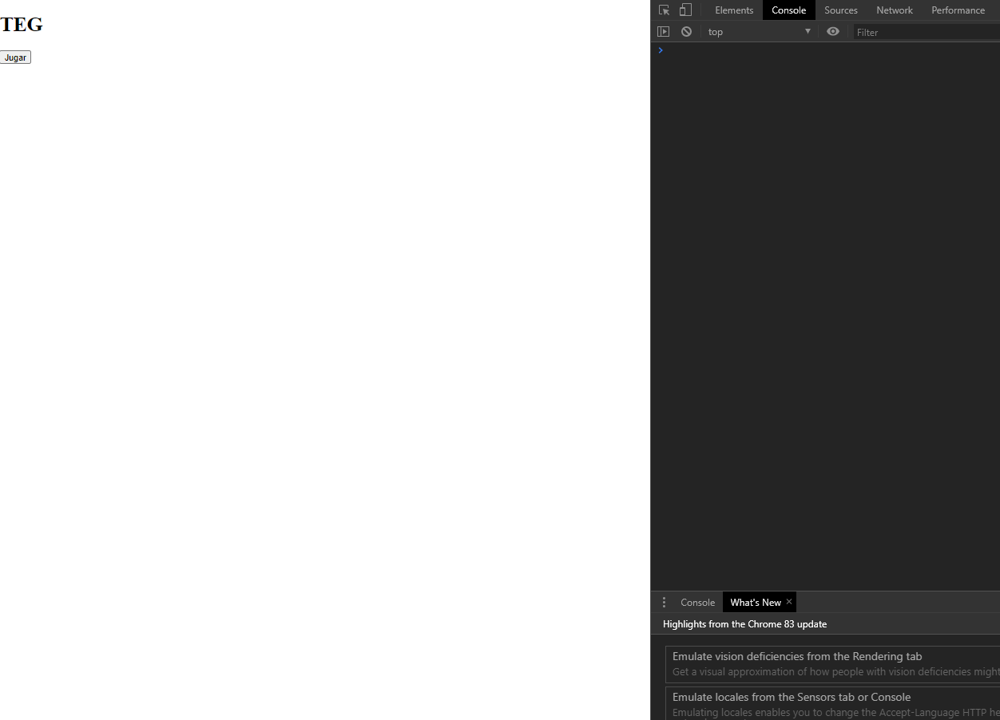

# **Random TEG**

Is a interactive game inspired by the board games like **TEG** and **RISK**.

## **Table of contents**

- [**Random TEG**](#random-teg)
  - [**Table of contents**](#table-of-contents)
  - [**General info**](#general-info)
  - [**Demo**](#demo)
  - [**Screenshots**](#screenshots)
  - [**Technologies**](#technologies)
  - [**Setup**](#setup)
  - [**Usage**](#usage)
  - [**Status**](#status)
  - [**Contact**](#contact)

## **General info**

**Date**: December, 2019.  
**Duration**: 1 Week.

During the winter holidays I want to learn more about **JavaScript** and I set myself a challenge, develop a game with only **Vanilla JS** without frameworks and external libraries, because I was beginning with this language and I needed to practice.

I have called the game **Random TEG** because I wanted to develop an algorithm for generate the countries randomly and since I had no idea how to do it, it occurred to me to create a board with **Grid** from **CSS** and every tile would be composed of 10,000 Divs 🤪 (100x100), because I needed each pixel to save states. So I distributed the code in classes and finally I designed the algorithm for the random generation of countries.

Unfortunately the project got quite big and very poorly optimized (around 20 seconds for create the board...) because of the 10,000 divs per tile and since I didn't have time, I abandoned it.

## **Demo**

You can try it using the [Demo](https://udsgit.github.io/random-teg).

\*_Remember that generating the map takes about 20 seconds_

> <br><i>Demo</i>

## **Screenshots**

> 
> <br><i>Example of boards created randomly and zooming to appreciate 10,000 divs/pixels.</i>

## **Technologies**

- **Html**
- **Css**
- **JavaScript**

## **Setup**

It has no installation, you just need to clone or download the repository.

```console
git clone https://github.com/udsgit/random-teg.git
```

## **Usage**

1. Open the link from the [Demo](https://udsgit.github.io/random-teg) or open the file **index.html** if you downloaded it.
2. Open the browser console, because all the information about the game is explained there, unfortunately it is in Spanish.
3. Add each player writing their name and choosing their color.
4. Press **_Crear tablero_** _it can take about 20 seconds to generate the board_.
5. The first round is to incorporate troops, each player will have to add 8 tokens to their countries using **_shift + click_**, then the player will press **_Acabar turno_**.
6. The second round is similar but only incorporates 4 tokens in the same way.
7. The third round is when the first player will attack by dragging a token from one of their countries and drop it in an enemy bordering country. A new window will appear to roll the dice. _From here the project was abandoned, therefore it is probably not working well, even the drag function may have some problems._

## **Status**

Project is: **_Abandoned._**

Because the project was intended to be practiced for a week and became a larger and more complex project.

## **Contact**

Created by [@Emmanuel](https://www.linkedin.com/in/emagleza/), feel free to contact me!
