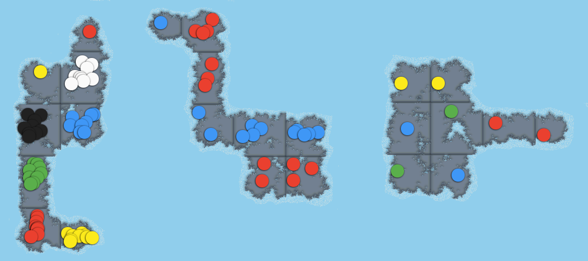
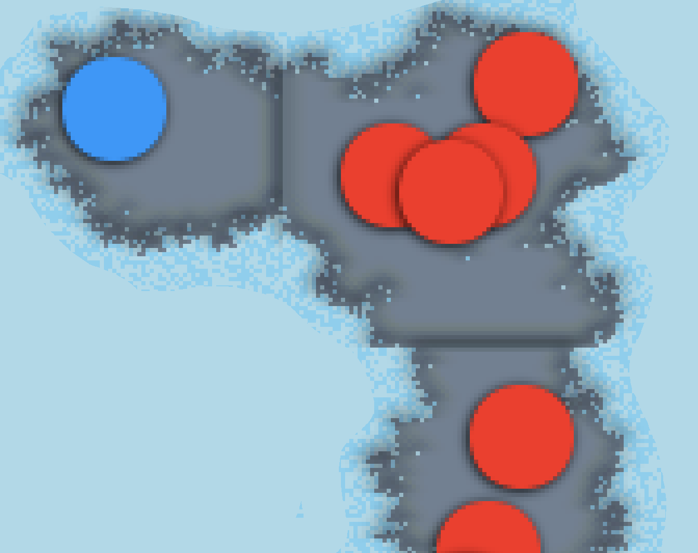

# **Random T.E.G.**

## **Resumen**

Es un proyecto abandonado, el cual estaba inspirado en el juego de mesa **T.E.G.** (similar al **RISK**), pero con la diferencia de que el mapa siempre se generaría aleatoriamente.

## **Información sobre el proyecto**

**Motivo:** Practicar JS.  
**Fecha:** Diciembre 2019.  
**Duración:** 1 Semana.  
**Autor:** Emmanuel González.

**Comentarios:** Durante las vacaciones de invierno he querido practicar **JS** y me propuse un reto para ello, desarrollar el juego de mesa **T.E.G.** (similar al **RISK**) y que generase el mapa de forma aleatoria usando **Vanilla JS** sin ningún tipo de librería, ya que hasta el momento es lo único que conocía porque llevaba 2 meses aprendiendo **JS**. Lo que se me ocurrió fue crear un tablero con **GRID** de **CSS** y que cada loseta estuviera formado por 10.000 DIVS (100x100) para que cada una de ellas representase un pixel para poder pintarlo. Luego distribuí el código por clases para tenerlo más ordenado y diseñe un algoritmo para que se crease aleatoriamente cada país y posteriormente sus países limítrofes manteniendo la forma del continente como si de una isla se tratase. **Lamentablemente el proyecto se había convertido en algo bastante grande y se abandono por no disponer de tiempo.*

## **Web interactiva**

https://udsgit.github.io/teg-game

## **Imágenes**

*Ejemplo de 3 Tableros creados aleatoriamente.*  

*Ejemplo de Loseta con zoom para apreciar los 10.000 divs.*

## **Instalación**

No tiene instalación, simplemente hay que clonar/descargar el repositorio.

## **Guía de uso**

1. Abrir el enlace del apartado **Web Interactiva** o ejecutar el archivo **index.html** con el navegador.
2. Abrir la consola del navegador, ya que es donde saldrá la información del juego.
3. Añadir los jugadores junto al color elegido y crear el tablero **puede tardar más de 20 segundos en generarse el mapa*.
4. La primera ronda es la de incorporación inicial, cada jugador tendrá que incorporar 8 fichas utilizando **control + click** a su país elegido y luego pulsara el botón de finalizar turno.
5. La segunda ronda también es de incorporación pero solo 4 fichas, se hace de la misma manera.
6. La tercera ronda es cuando comienzan los ataques y para ello hay que arrastrar el país seleccionado propio sobre el país limítrofe enemigo y aparecerá una ventana para atacar con los dados. **a partir de aquí se abandono el proyecto, por lo tanto es probable que no funcione bien, incluso la función de arrastrar puede tener algunos problemas*.
